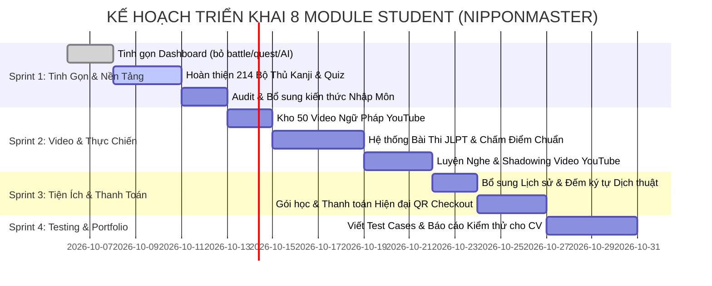

# 🎓 KẾ HOẠCH PHÁT TRIỂN MODULE STUDENT (NIPPONMASTER)
> **Phiên bản**: 3.1 — Checklist Tiến Độ Chi Tiết Cho CV / Portfolio Software Tester  
> **Ngày cập nhật**: 2026-10-05  
> **Mục tiêu dự án**: Xây dựng web app học tiếng Nhật chuẩn mực, giao diện hiện đại, dữ liệu xác định (deterministic), luồng nghiệp vụ chặt chẽ, loại bỏ hoàn toàn các yếu tố AI/ngẫu hứng phi tất định để phục vụ tối đa việc viết Test Plan, Test Cases, áp dụng các kỹ thuật kiểm thử (BVA, Equivalence Partitioning, State Transition, Decision Table, API Testing).

---

## 🧭 TỔNG QUAN HỆ THỐNG & ĐỊNH HƯỚNG TINH GỌN

### 1. Nguyên Tắc Cốt Lõi:
1. **Loại bỏ 100% tính năng AI**: Không dùng AI grading, AI evaluation, AI free-chat, AI voice scoring. Mọi kết quả chấm điểm, dữ liệu trả về đều theo quy tắc logic xác định (deterministic rules), giúp xác định rõ vùng biên (Boundary Value Analysis - BVA) và lớp tương đương (Equivalence Partitioning).
2. **Loại bỏ tính năng gamification rườm rà**: Bỏ 5 Daily Quests ngẫu nhiên, hệ thống huy hiệu/badge phức tạp, chế độ Battle Arena 1v1 với bot, bảng vẽ canvas AI, phân loại trình độ trong Kanji.
3. **Chuẩn hóa đúng 8 Module cốt lõi** hiển thị trên thanh điều hướng Sidebar:
   - 📊 **1. Dashboard**: Chuỗi ngày học (Streak), Tiến độ 4 kỹ năng, Flashcard ôn tập nhanh.
   - 🔰 **2. Nhập Môn (Beginner)**: Bảng chữ cái Hiragana/Katakana, Số đếm & Thời gian, Chào hỏi & Xưng hô, Bộ thủ tượng hình, Cấu trúc câu nhập môn & Bài test tốt nghiệp.
   - 🈸 **3. Kanji (214 Bộ Thủ)**: Lộ trình 214 bộ thủ Khang Hy (Bushu), tra cứu theo số nét, học nghĩa/âm đọc, trắc nghiệm ôn tập.
   - 📖 **4. Grammar (Ngữ Pháp)**: Hệ thống ~50 video bài giảng YouTube chọn lọc, player nhúng, ghi chú công thức, tracking đã xem.
   - 🎯 **5. Exams (Bài Thi JLPT)**: Form thi JLPT chuẩn thời gian thực (N5–N1), chia phần Chữ Hán/Từ Vựng, Ngữ Pháp/Đọc Hiểu, Nghe Hiểu, tính điểm và chấm Đậu/Rớt có điểm liệt.
   - 🌐 **6. Translation (Dịch Thuật 3 Ngôn Ngữ)**: Tiếng Nhật - Tiếng Việt - Tiếng Anh, hoán đổi chiều dịch, lịch sử dịch, copy, TTS native, đếm ký tự (phục vụ test biên).
   - 🎧 **7. Luyện Nghe (Listening & Shadowing)**: Video YouTube bài nghe đời thực/JLPT, phụ đề song ngữ theo timestamp, chế độ lặp câu/tua lùi phục vụ Shadowing, ẩn/hiện dịch.
   - 💳 **8. Gói Học (Pricing & Payment)**: Bảng giá Pro, quy trình checkout hiện đại, thanh toán QR/mô phỏng, kích hoạt subscription, lịch sử giao dịch.

---

## 🛠️ KIẾN TRÚC CÔNG NGHỆ (TECH STACK)

| Tầng | Công nghệ sử dụng | Vai trò & Đặc điểm |
|---|---|---|
| **Frontend** | React 19 + TypeScript + Vite | SPA hiệu năng cao, type safety chặt chẽ cho DTO |
| **Styling & UI** | Tailwind CSS + Lucide Icons + GSAP/Framer Motion | Giao diện hiện đại, micro-animations mượt mà, dark/light theme |
| **State & Storage** | Zustand + LocalStorage / Cookie | Quản lý auth state, cache dữ liệu tiến độ, lịch sử |
| **Backend API** | Java 17 + Spring Boot 3.x | Kiến trúc RESTful Clean Architecture, Spring Security + JWT |
| **Database** | PostgreSQL / Supabase + Spring Data JPA | Quan hệ dữ liệu chuẩn hóa, transactional integrity cho thanh toán và thi |
| **Media Player** | YouTube Iframe Player API + Web Speech API (TTS) | Phát video YouTube bài giảng & nghe, phát âm chuẩn native không cần AI |

---

## 📑 CHI TIẾT 8 MODULE CHỨC NĂNG & CHECKLIST CÔNG VIỆC

---

### MODULE 1: DASHBOARD (BẢNG ĐIỀU KHIỂN HỌC VIÊN)

#### 1. Mục tiêu & Flow Nghiệp Vụ
- Cung cấp cái nhìn tổng quan về trạng thái học tập của học viên ngay khi đăng nhập.
- **Chuỗi ngày học (Daily Streak)**:
  - Nếu hôm nay học viên có ít nhất 1 hành động học (làm quiz, xem video, lật flashcard) → Streak tăng +1 (hoặc giữ nguyên nếu đã điểm danh hôm nay).
  - Nếu cách ngày hôm qua không học → Reset streak về 1.
  - Hiển thị widget 7 ngày gần nhất (Thứ 2 → CN) trực quan hóa ngày nào đã học (đánh dấu check).
- **Tiến độ từng chức năng (Progress Tracker)**:
  - Tiến độ Nhập môn (% hoàn thành 5 chương).
  - Tiến độ Bộ thủ Kanji (số bộ thủ đã học / 214).
  - Tiến độ Ngữ pháp (số video đã xem / tổng số video).
  - Tiến độ Luyện nghe (số bài nghe đã hoàn thành).
  - Lịch sử bài thi gần nhất (điểm số, ngày thi, kết quả Pass/Fail).
- **Flashcard ôn tập nhanh (Quick Review Deck)**:
  - Widget lật thẻ tương tác 2 mặt: Chạm vào khoảng trống trên thẻ để lật qua lại giữa mặt trước (Ký tự/Từ vựng) và mặt sau (Chi tiết, âm đọc, nghĩa, ví dụ, loa phát âm). Giữ nguyên cơ chế lật thẻ này.
  - **Thuật toán Spaced Repetition (SRS - Lặp lại ngắt quãng)** với 3 nút đánh giá xuất hiện ở mặt sau thẻ:
    * **Dễ** (Easy): Ôn lại sau 7 ngày (`nextReviewDate = today + 7`).
    * **Thường** (Medium): Ôn lại sau 3 ngày (`nextReviewDate = today + 3`).
    * **Khó** (Hard): Ôn lại vào ngày hôm sau (`nextReviewDate = today + 1`).
  - **Cơ chế 10 thẻ thay đổi mỗi ngày (Daily Rotation)**: Mỗi ngày hệ thống tự động bốc 10 thẻ mới/thẻ đến hạn ôn tập từ kho dữ liệu, đảm bảo mỗi ngày 10 thẻ luôn có sự thay đổi mới và không lặp lại các thẻ đã được lên lịch trong tương lai.

#### 2. Phân chia Task thực hiện (Checklist)
- [x] **Task 1.1: Tinh gọn DashboardStudent.tsx**
  - [x] Gỡ bỏ các module Battle Arena, Bot đấu 1v1, Quests 5 nhiệm vụ hàng ngày.
  - [x] Gỡ bỏ hệ thống Theme Shop local và các logic dính líu đến AI canvas.
  - [x] Tái cấu trúc file thành các component sạch sẽ, duy trì file chính < 350 dòng.
- [x] **Task 1.2: Xây dựng cơ chế Streak Duolingo & Điểm danh Flashcard**
  - [x] Triển khai logic Streak vô hạn: Tăng dần theo ngày, tự động mất chuỗi (reset về 0) nếu quên điểm danh quá 1 ngày.
  - [x] Điều kiện điểm danh nghiêm ngặt: Phải hoàn thành tối thiểu 10/10 thẻ flashcard trong ngày mới được tính điểm danh.
  - [x] Hiển thị dòng ghi chú bắt buộc: *"Bạn phải tối thiểu hoàn thành hết flashcard hôm nay mới được tính điểm danh nhé"*.
  - [x] Render giao diện ngọn lửa rực sáng khi giữ lửa, thanh tiến độ thẻ và dải 7 ngày tuần hiện tại.
- [x] **Task 1.3: Xây dựng component ModuleProgressOverview**
  - [x] Tính toán % tiến độ tích lũy thực tế của 4 kỹ năng (Nhập môn: 5 chương, 214 Bộ thủ Khang Hy, Ngữ pháp: 50 bài giảng, Luyện nghe: 20 kịch bản).
  - [x] Render 4 card tiến độ kèm hiệu ứng progress bar động, đa sắc màu riêng biệt (Emerald, Amber, Indigo, Cyan) kết hợp Watermark chữ Hán/Kana chìm (`あ`, `漢`, `文`, `聴`) và nút hành động trực quan.
  - [x] Xử lý sự kiện click chuyển hướng trực tiếp đến từng màn hình tương ứng (`beginner`, `kanji`, `grammar`, `listening`).
  - [x] Tối ưu HeroCockpit: Gỡ bỏ card "Thời gian học tuần", tinh gọn thanh thống kê thành 3 card cân đối (Streak, Lộ trình, Flashcard).
- [x] **Task 1.4: Triển khai thuật toán Spaced Repetition (SRS) & Bộ 10 Flashcard thay đổi mỗi ngày**
  - [x] Giữ nguyên cơ chế tương tác lật thẻ 3D khi click vào khoảng trống trên thẻ.
  - [x] Xây dựng 3 nút đánh giá ở mặt sau thẻ: "Dễ" (+7 ngày), "Thường" (+3 ngày), "Khó" (+1 ngày).
  - [x] Xây dựng cơ chế cấp 10 thẻ hàng ngày: Ưu tiên thẻ đến hạn ôn tập (`dueDate <= today`) + bù đắp thẻ mới chưa học, đảm bảo mỗi ngày 10 thẻ hoàn toàn mới và không xuất hiện các thẻ đã hẹn lịch tương lai.
  - [x] Lưu trữ trạng thái SRS vào `localStorage` (`nippon_card_srs_records_v1`), tự động cập nhật tiến độ điểm danh hôm nay và chuyển thẻ tiếp theo sau khi chọn mức độ.

#### 3. Góc nhìn Kiểm thử (Tester Perspective)
- **Kỹ thuật áp dụng**: Boundary Value Analysis (BVA), Equivalence Partitioning (EP), State Transition Testing.
- **Test Scenarios cho Cơ chế Streak Duolingo & Điểm danh**:
  - `TC_DASH_01 (EP - Thiếu điều kiện)`: Học 0 đến 9 thẻ flashcard (biên dưới 9/10) → Hệ thống hiển thị tiến độ N/10 thẻ, badge "Chưa điểm danh", Streak không tăng.
  - `TC_DASH_02 (BVA - Đạt ngưỡng)`: Vừa học đạt thẻ thứ 10/10 trong ngày → Hệ thống kích hoạt điểm danh: Streak tăng +1, icon lửa rực sáng, dải ngày hôm nay được đánh dấu active, badge chuyển thành "✓ Đã giữ lửa".
  - `TC_DASH_03 (Idempotency)`: Tiếp tục học thẻ thứ 11, 12... trong cùng một ngày → Streak không được cộng dồn thêm (chỉ tính 1 lần/ngày).
  - `TC_DASH_04 (State Transition - Giữ chuỗi)`: Sang ngày hôm sau (khoảng cách 1 ngày) → Streak ngày cũ được bảo toàn, trạng thái ngày mới reset về "Chưa điểm danh" (0/10 thẻ).
  - `TC_DASH_05 (State Transition - Mất chuỗi)`: Quên điểm danh từ 1 ngày trở lên (khoảng cách ngày > 1, ví dụ 2 ngày không vào học) → Streak lập tức bị đứt và reset về 0.
  - `TC_DASH_06 (UI Requirement)`: Kiểm tra sự tồn tại của dòng ghi chú điều kiện: *"Bạn phải tối thiểu hoàn thành hết flashcard hôm nay mới được tính điểm danh nhé"*.
  - `TC_DASH_07 (UI Interaction)`: Kiểm tra widget Flashcard lật 2 mặt khi click vào bất kỳ khoảng trống nào trên thẻ, không bị che khuất và phản hồi mượt mà.
- **Test Scenarios cho Tiến độ 4 Module Cốt lõi (Task 1.3)**:
  - `TC_DASH_08 (BVA - % Tiến độ Module)`: Kiểm tra tính toán % tiến độ các giá trị biên: 0% (chưa học), 20% (1/5 chương Nhập môn), 50%, 100% (hoàn thành toàn bộ).
  - `TC_DASH_09 (UI Navigation)`: Click vào từng thẻ trong 4 card tiến độ → Điều hướng chính xác tới các màn hình tương ứng (`beginner`, `kanji`, `grammar`, `listening`).
  - `TC_DASH_10 (Calculation - Overall Mastery)`: % Lộ trình tổng thể hiển thị chính xác bằng trung bình cộng của 4 module: `(P_beg + P_kan + P_gra + P_lis) / 4`.
- **Test Scenarios cho Thuật toán SRS & Đổi thẻ Hàng ngày (Task 1.4)**:
  - `TC_DASH_11 (SRS Interval - Dễ)`: Bấm "Dễ" → Kiểm tra `nextReviewDate = today + 7 ngày`, thẻ biến mất khỏi deck hôm nay và 6 ngày kế tiếp.
  - `TC_DASH_12 (SRS Interval - Thường)`: Bấm "Thường" → Kiểm tra `nextReviewDate = today + 3 ngày`.
  - `TC_DASH_13 (SRS Interval - Khó)`: Bấm "Khó" → Kiểm tra `nextReviewDate = today + 1 ngày` (xuất hiện lại vào ngày mai).
  - `TC_DASH_14 (Daily Deck Rotation)`: Sang ngày hôm sau (hoặc giả lập ngày) → Deck 10 thẻ được cập nhật với các thẻ mới hoặc thẻ đã đến hạn review, không bị lặp lại các thẻ chưa đến hạn.
  - `TC_DASH_15 (UI Interaction - Mặt sau 3 nút)`: Mặt trước chỉ hiển thị từ và nút nghe âm thanh; khi click thẻ lật ra mặt sau thì 3 nút "Dễ - Thường - Khó" xuất hiện nổi bật; click nút không gây xung đột lật ngược thẻ.

---

### MODULE 2: NHẬP MÔN (BEGINNER COURSE) - 5 CHƯƠNG TUẦN TỰ

#### 1. Lộ trình 5 Chương chuẩn hóa
- **Chương 1: Bảng Chữ Cái & Quy Tắc Âm Đọc (Alphabet & Extended Sound Rules)**
- **Chương 2: Số Đếm, Đơn Vị Đếm & Thời Gian (Numbers, Counters & Time)**
- **Chương 3: Chào Hỏi Giao Tiếp & Xưng Hô Văn Hóa (Aisatsu Phrases & Etiquette)**
- **Chương 4: 50+ Bộ Thủ Tượng Hình Nền Tảng (Kanji Radicals)**
- **Chương 5: Cấu Trúc Câu & Thì Ngữ Pháp Nhập Môn (Basic Grammar Structures)**

---

#### 2. Chi tiết thực hiện theo từng Chương

##### [HOÀN THÀNH 100%] Chương 1: Bảng Chữ Cái & Quy Tắc Âm Đọc
- [x] **Bổ sung Quy tắc âm đọc mở rộng**:
  * Đầy đủ Âm đục (Dakuon - 20 âm) và Âm bán đục (Handakuon - 5 âm).
  * Đầy đủ Âm ghép (Yōon - 33 âm) cho cả Hiragana và Katakana.
  * Chuyên đề Cẩm nang Quy tắc âm đọc:
    - 促音 Âm Ngắt (Sokuon - chữ `っ/ッ` nhỏ, gấp đôi phụ âm k, s, t, p).
    - 長音 Trường Âm (Chōon - Hiragana kép & Katakana dấu gạch ngang `ー`).
    - 撥音 Âm Mũi (Hatsuon - chữ `ん/ン`).
    - Bảng đối chiếu tương phản (kitte vs kite, obaasan vs obasan) kèm audio phát âm Web Speech API.
- [x] **Loại bỏ hoàn toàn AI đánh giá nét chữ — Chuyển sang Tự luyện viết kèm Thứ tự nét chuẩn**:
  * Gỡ bỏ nút đánh giá và logic chấm điểm AI gây khó khăn / đánh giá sai lệch cho học viên.
  * Tích hợp hoạt ảnh thứ tự nét viết chuẩn (`KanjiStrokeWriter`) hiển thị số thứ tự nét (1, 2, 3...) và nút phát lại chuyển động nét.
  * Trang bị bảng vẽ Washi cho học viên tự do đồ theo nét mờ, có bộ công cụ: Hoàn tác nét, Xóa bảng vẽ, Ẩn/Hiện mẫu chữ để tự kiểm tra trí nhớ.
  * Hướng dẫn sư phạm trực quan giúp người học tự luyện viết đến khi quen tay rồi chuyển sang bước Phát âm.
- [x] **Đồng bộ hóa tên nút khởi động**:
  * Đổi tất cả các nút `"Học hàng này"` thành `"Bắt đầu"`.
- [x] **Tái cấu trúc luồng học và Thang điều hướng 4 Thẻ**:
  * Thẻ 1: `🔤 Bảng Tổng Quan` (Tra cứu, nghe phát âm, học quy tắc âm đọc, bấm "Bắt đầu" theo từng hàng).
  * Thẻ 2: `📖 Bài Học` (Học từng chữ của hàng: Học mặt chữ -> Viết -> Phát âm chuẩn).
  * Thẻ 3: `✨ Luyện Tập` (Tự động chuyển sang khi học xong 1 hàng, chỉ kiểm tra các chữ của hàng đó).
    - Màn hình kết quả hàng có đúng 2 nút:
      1. `"Làm lại"`: Luyện lại chính hàng vừa học.
      2. `"Bài tiếp theo"`: Chuyển sang hàng tiếp theo của bảng chữ cái (`a` → `ka` → `sa` → `ta`... → `wa` → `ga` → `za`... → `pa` → `kya`...) và tự động mở tab Bài Học.
  * Thẻ 4: `🃏 Luyện Tập Tổng Hợp` (Ngân hàng 60 đề thi độc lập - tối thiểu 15 bài riêng biệt cho mỗi mục: Toàn bộ Hiragana, Katakana, Trộn lẫn cả 2 bảng, và Âm ghép Yōon. Mỗi bài có mục tiêu sư phạm riêng, không trùng lặp, lưu điểm số từng bài).

---

##### [HOÀN TẤT] Chương 2: Số Đếm, Đơn Vị Đếm & Thời Gian
- [x] Bổ sung bảng số đếm người đặc biệt (hitori, futari, yonin, cụm từ cô đơn hitoribocchi...).
- [x] Bổ sung bảng ngày trong tháng từ ngày 1 đến ngày 31 (tsuitachi, futsuka... hatsuka) với filter ngày bất quy tắc & mẹo phân biệt.
- [x] Bổ sung quy tắc đếm tuổi đặc biệt (二十歳 - はたち hatachi, các biến âm sokuon 1, 8, 10 tuổi & câu hỏi tuổi/kính ngữ).
- [x] Bài luyện tập phản xạ chuyển đổi số và giờ giấc (Chế độ Flash Speed Reflex mode với chuỗi streak đúng liên tiếp).

##### [CHỜ XỬ LÝ] Chương 3: Chào Hỏi Giao Tiếp & Xưng Hô Văn Hóa
##### [CHỜ XỬ LÝ] Chương 4: 50+ Bộ Thủ Tượng Hình Nền Tảng
##### [CHỜ XỬ LÝ] Chương 5: Cấu Trúc Câu & Thì Ngữ Pháp Nhập Môn

---

#### 3. Góc nhìn Kiểm thử Chương 1 (Tester Perspective)
- `TC_BEG_01 (Zero AI Label)`: Kiểm tra giao diện canvas không còn xuất hiện từ "AI" hay emoji "🤖", nút hiển thị đúng "Đánh giá".
- `TC_BEG_02 (Start Button Label)`: Mọi nút học hàng trên Bảng tổng quan hiển thị "Bắt đầu".
- `TC_BEG_03 (Row-by-Row Quiz Flow)`: Học xong hàng 'a' -> Chuyển sang Luyện tập hàng 'a' -> Hoàn thành bài test -> Bấm "Bài tiếp theo" -> Hệ thống nạp hàng 'ka' vào Bài học.
- `TC_BEG_04 (Retry Row Quiz)`: Ở màn hình kết quả hàng 'a', bấm "Làm lại" -> Test lại riêng hàng 'a' mà không bị chuyển sang đề tổng hợp mix.
- `TC_BEG_05 (Comprehensive Practice Tab)`: Thẻ "Luyện Tập Tổng Hợp" có đầy đủ picker (Toàn bộ Hiragana, Katakana, Trộn lẫn, Âm ghép), hoàn thành có nút "Làm lại" và "Chọn phạm vi khác".
- `TC_BEG_06 (Extended Sound Rules)`: Mở Bảng tổng quan -> Section Quy tắc âm đọc -> Nghe được âm thanh của Âm ngắt, Trường âm và bảng tương phản.

---

### MODULE 3: KANJI (214 BỘ THỦ CHUẨN KHANG HY)

#### 1. Mục tiêu & Flow Nghiệp Vụ
- Thay vì phân tán theo cấp độ JLPT N5–N1 hay dùng canvas vẽ AI phức tạp, chuẩn hóa module Kanji thành: **Lộ trình học đầy đủ 214 Bộ Thủ Kanji (Bushu - 部首)**.
- **Giao diện & Danh mục 214 Bộ thủ**:
  - Phân loại theo số nét từ 1 nét đến 17 nét:
    * Nhóm 1: 1–2 nét (Bộ Nhất 一, Cổn 丨, Điểm 丶, Phiệt 丿, Ất 乙, Quyết 亅, Nhị 二, Nhân 人, Nhập 入, Bát 八,...).
    * Nhóm 2: 3 nét (Bộ Khẩu 口, Vi 囗, Thổ 土, Sĩ 士, Đại 大, Nữ 女, Tử 子, Sơn 山, Xuyên 川,...).
    * Nhóm 3: 4 nét (Tâm 心, Thủ 手, Nhật 日, Nguyệt 月, Mộc 木, Thủy 水, Hỏa 火,...).
    * Nhóm 4: 5–6 nét.
    * Nhóm 5: 7–8 nét.
    * Nhóm 6: 9–17 nét.
  - Thông tin chi tiết mỗi bộ thủ:
    * Ký tự bộ thủ & biến thể (ví dụ: Nhân 人 -> Nhân đứng 亻; Thủy 水 -> Ba chấm thủy 氵; Tâm 心 -> Tâm đứng 忄).
    * Tên Hán Việt, Ý nghĩa tiếng Việt, Phiên âm Romaji & Hiragana.
    * Vị trí bộ thủ trong chữ: *Hen* (bên trái), *Tsukuri* (bên phải), *Kanmuri* (ở trên), *Ashi* (ở dưới), *Kamae/Tare/Nyoo* (bao bọc).
    * Các chữ Hán tiêu biểu chứa bộ thủ đó (ví dụ bộ Mộc 木 -> Bản 本, Hưu 休, Lâm 林, Sâm 森).
- **Bộ lọc & Tìm kiếm**:
  - Thanh tìm kiếm nhanh: Tìm theo chữ Hán, tên Hán Việt (ví dụ gõ "mộc" hoặc "thủy"), nghĩa tiếng Việt.
  - Filter theo số nét (1–17 nét).
- **Trắc nghiệm ôn tập bộ thủ (Radicals Quiz)**:
  - Chọn số câu: 10 câu / 20 câu.
  - Dạng 1: Cho bộ thủ → Chọn tên Hán Việt & ý nghĩa.
  - Dạng 2: Cho nghĩa tiếng Việt → Chọn ký tự bộ thủ đúng.
  - Dạng 3: Cho chữ Kanji hoàn chỉnh → Xác định bộ thủ cấu thành chữ đó.
  - Kết quả: Điểm số, thời gian làm bài, danh sách câu sai cần ôn lại.

#### 2. Phân chia Task thực hiện (Checklist)
- [ ] **Task 3.1: Chuẩn bị dataset chuẩn 214 Bộ Thủ Kanji**
  - [ ] Tạo file dữ liệu `frontend/src/data/kanjiRadicals214.ts` đầy đủ 214 bộ thủ Khang Hy.
  - [ ] Cấu trúc chuẩn từng bản ghi: `id (1-214)`, `character`, `variants`, `hanViet`, `meaning`, `strokeCount`, `position`, `examples`.
- [ ] **Task 3.2: Thiết kế lại giao diện Kanji.tsx**
  - [ ] Loại bỏ tab Canvas Studio và bộ lọc cấp độ N5–N1.
  - [ ] Thêm thanh tìm kiếm đa năng (theo chữ Hán, Hán Việt, tiếng Việt không dấu).
  - [ ] Thêm bộ lọc số nét (Filter 1-17 nét) và grid hiển thị card 214 bộ thủ đẹp mắt.
  - [ ] Thêm panel xem chi tiết thông tin bộ thủ bên phải màn hình khi click chọn.
- [ ] **Task 3.3: Xây dựng modal làm Quiz ôn tập RadicalQuizModal.tsx**
  - [ ] Xây dựng thuật toán random 10-20 câu hỏi trắc nghiệm từ 214 bộ thủ.
  - [ ] Hiển thị 4 phương án lựa chọn, tính điểm tức thì khi hoàn thành.
  - [ ] Liệt kê danh sách các câu trả lời sai để học viên tiện ôn lại.

#### 3. Góc nhìn Kiểm thử (Tester Perspective)
- **Kỹ thuật áp dụng**: Boundary Value Analysis, Search & Filter Testing.
- **Test Scenarios**:
  - `TC_KANJI_01`: Tìm kiếm với ký tự không tồn tại → Hiển thị empty state "Không tìm thấy bộ thủ phù hợp".
  - `TC_KANJI_02`: Lọc theo số nét nhỏ nhất (1 nét) → Trả về đúng 6 bộ thủ (一, 丨, 丶, 丿, 乙, 亅).
  - `TC_KANJI_03`: Lọc theo số nét lớn nhất (17 nét) → Trả về đúng 1 bộ thủ (Dược 龠).
  - `TC_KANJI_04`: Kiểm tra tổng số bản ghi trong danh sách luôn là đúng 214 bản ghi.
  - `TC_KANJI_05`: Làm quiz đúng 10/10 → Hiển thị 100 điểm, đúng 0/10 → Hiển thị 0 điểm.

---

### MODULE 4: GRAMMAR (NGỮ PHÁP QUA VIDEO YOUTUBE)

#### 1. Mục tiêu & Flow Nghiệp Vụ
- Thay thế danh sách ngữ pháp khô khan bằng: **Hệ thống ~50 video bài giảng YouTube ngữ pháp chọn lọc** (chia theo từng bài học Minna no Nihongo / Ngữ pháp N5–N4 nền tảng).
- **Giao diện học tập**:
  - Cột trái (hoặc phần chính): Video Player YouTube nhúng chuẩn Iframe (hỗ trợ play/pause, tua 10s, chọn tốc độ phát, full screen).
  - Cột phải: Playlist danh sách 50 video với:
    * Số thứ tự bài (Bài 01 → Bài 50).
    * Tiêu đề bài giảng (ví dụ: *Bài 1: Cấu trúc câu khẳng định & nghi vấn N1 は N2 です*).
    * Thời lượng video (ví dụ: *12:45*).
    * Trạng thái: "Đã xem" (icon check xanh) hoặc "Chưa xem".
- **Ghi chú & Tóm tắt bên dưới video**:
  - Tóm tắt công thức ngữ pháp trọng tâm trong video.
  - Bảng ví dụ mẫu song ngữ Nhật - Việt kèm giải thích ngữ cảnh.
  - Nút bấm: "Đánh dấu đã hoàn thành bài này" để cập nhật tiến độ học tập.

#### 2. Phân chia Task thực hiện (Checklist)
- [ ] **Task 4.1: Xây dựng kho dữ liệu 50 video YouTube ngữ pháp**
  - [ ] Tạo file `frontend/src/data/grammarVideosData.ts` chứa danh mục 50 bài giảng ngữ pháp.
  - [ ] Cấu trúc dữ liệu: `id`, `lessonNumber`, `title`, `youtubeUrl`, `youtubeId`, `duration`, `summaryPoints`, `patterns: [{ pattern, meaning, exampleJp, exampleVi }]`.
- [ ] **Task 4.2: Cải tạo giao diện Grammar.tsx thành Video Learning Studio**
  - [ ] Nhúng YouTube Iframe Player responsive, hỗ trợ tua, chỉnh âm lượng và fullscreen.
  - [ ] Tạo thanh playlist 50 video bên cạnh có thể cuộn, tìm kiếm bài học nhanh.
  - [ ] Tạo tab "Ghi Chú Ngữ Pháp" ngay dưới video hiển thị công thức và ví dụ mẫu.
- [ ] **Task 4.3: Xử lý Tracking hoàn thành bài học**
  - [ ] Thêm nút "Đánh dấu đã xem bài này" lưu ID vào `watched_grammar_videos` trong LocalStorage.
  - [ ] Đồng bộ hiển thị badge tick xanh trên playlist và cập nhật thanh % tiến độ trên Dashboard.

#### 3. Góc nhìn Kiểm thử (Tester Perspective)
- **Kỹ thuật áp dụng**: State Verification, Video Event Handling.
- **Test Scenarios**:
  - `TC_GRAM_01`: Bấm vào video thứ 5 trong danh sách → Player nạp đúng URL video ID thứ 5, cập nhật tiêu đề và phần tóm tắt ngữ pháp tương ứng.
  - `TC_GRAM_02`: Bấm nút "Đánh dấu đã học" → Đổi trạng thái sang "Đã xem", thanh tiến độ tăng thêm 2% (1/50).
  - `TC_GRAM_03`: Bấm lại lần nữa để bỏ đánh dấu → Đổi trạng thái sang "Chưa xem", thanh tiến độ giảm tương ứng.
  - `TC_GRAM_04`: Tìm kiếm bài học theo từ khóa "から" → Danh sách filter đúng các video chứa cấu trúc này.

---

### MODULE 5: EXAMS (BÀI THI JLPT THỰC CHIẾN)

#### 1. Mục tiêu & Flow Nghiệp Vụ
- Mô phỏng sát kỳ thi thật JLPT với các bộ đề thực tế theo từng năm (dữ liệu format JSON chuẩn hóa để dễ import).
- **Cấu trúc Đề thi JLPT Chuẩn**:
  - Cấp độ lựa chọn: N5, N4, N3 (và mở rộng N2, N1).
  - Từng đề thi chia thành 3 phần rõ ràng:
    1. **Phần 1: Chữ Hán - Từ Vựng (文字・語彙)**: Cách đọc Kanji, tìm chữ Hán đúng, từ đồng nghĩa, cách dùng từ trong câu.
    2. **Phần 2: Ngữ Pháp & Đọc Hiểu (文法・読解)**: Ngữ pháp điền từ, sắp xếp sao `★`, đọc hiểu đoạn văn ngắn/trung bình/dài.
    3. **Phần 3: Nghe Hiểu (聴解)**: Nghe hiểu có tranh, nghe hiểu tình huống, nghe câu hỏi đáp ngắn (kèm audio player tích hợp).
- **Quy chế thi & Giao diện làm bài (Exam Room)**:
  - **Bộ đếm thời gian (Countdown Timer)**: Đếm ngược theo đúng số phút quy định của cấp độ (ví dụ N5: 60 phút). Cảnh báo màu đỏ khi còn < 5 phút.
  - **Bảng điều hướng câu hỏi (Question Matrix)**:
    * Ô câu hỏi đổi màu: Màu xám (chưa làm), Màu xanh dương (đã chọn đáp án), Màu vàng có cờ (đánh dấu xem lại sau).
    * Bấm vào số câu hỏi nhảy ngay đến câu đó trên màn hình.
  - **Nộp bài**:
    * Khi bấm "Nộp bài", nếu còn câu chưa làm → Hiển thị modal cảnh báo "Bạn còn X câu chưa trả lời. Bạn có chắc muốn nộp bài không?".
    * Khi hết giờ (00:00) → Tự động khóa form và nộp bài ngay lập tức.
- **Màn hình Kết quả & Giải thích chi tiết**:
  - Tổng điểm và điểm từng phần.
  - Đánh giá kết quả: **ĐẬU (Pass)** hoặc **RỚT (Fail)**:
    * Điều kiện đậu JLPT: Tổng điểm >= Điểm chuẩn VÀ không phần nào bị dưới Điểm liệt (ví dụ N5: Tổng >= 80/180 và từng phần >= 19/60).
  - Xem lại toàn bộ bài thi: Tô xanh đáp án đúng, tô đỏ đáp án user chọn sai, hiển thị lời giải thích chi tiết cho từng câu.
  - Lưu lịch sử lần thi vào danh sách kết quả (`exam_history`).

#### 2. Phân chia Task thực hiện (Checklist)
- [ ] **Task 5.1: Thiết kế JSON Schema và bộ dữ liệu đề thi mẫu N5**
  - [ ] Định nghĩa TypeScript interface cho bài thi: `Exam`, `ExamSection`, `Question`, `QuestionOption`.
  - [ ] Tạo file dữ liệu đề thi chuẩn các năm `frontend/src/data/mockExamsData.ts` (ví dụ N5-2022, N5-2023).
- [ ] **Task 5.2: Cải tạo màn hình danh sách đề thi Exams.tsx**
  - [ ] Hiển thị danh sách đề thi theo tab cấp độ N5, N4, N3.
  - [ ] Hiển thị card đề thi gồm: Thời gian thi, Số lượng câu hỏi, Lịch sử điểm cao nhất đã đạt.
- [ ] **Task 5.3: Xây dựng màn hình phòng thi trực tuyến ExamTakingModal.tsx**
  - [ ] Tích hợp đồng hồ đếm ngược Countdown Timer, tự động nộp bài khi hết giờ (00:00).
  - [ ] Xây dựng bảng điều hướng câu hỏi (Question Navigator Sheet) đánh dấu màu: Chưa làm, Đã làm, Đặt cờ.
  - [ ] Tích hợp trình phát audio cho phần thi Nghe Hiểu (Choukai).
  - [ ] Modal cảnh báo nộp bài khi vẫn còn câu chưa chọn đáp án.
- [ ] **Task 5.4: Xây dựng màn hình kết quả và giải thích chi tiết ExamResultModal.tsx**
  - [ ] Tính điểm chuẩn theo trọng số và phân loại ĐẬU/RỚT dựa trên tổng điểm và điểm liệt từng phần.
  - [ ] Hiển thị review chi tiết toàn bộ câu hỏi: đáp án của thí sinh vs đáp án chính xác kèm lời giải.
  - [ ] Lưu kết quả bài thi vào LocalStorage `exam_history` để hiển thị trên Dashboard.

#### 3. Góc nhìn Kiểm thử (Tester Perspective)
- **Kỹ thuật áp dụng**: Boundary Value Analysis (BVA), Decision Table, State Transition Testing.
- **Test Scenarios**:
  - `TC_EXAM_01`: Nộp bài khi tổng điểm = 79/180 (Điểm chuẩn đậu là 80) → Kết quả FAIL.
  - `TC_EXAM_02`: Tổng điểm = 100/180 nhưng phần Nghe hiểu = 18/60 (Điểm liệt là 19) → Kết quả FAIL do dính điểm liệt.
  - `TC_EXAM_03`: Tổng điểm = 80/180 và các phần >= 19/60 → Kết quả PASS (biên tối thiểu).
  - `TC_EXAM_04`: Để timer chạy hết về 00:00 → Form tự động submit, không cho chọn thêm đáp án.
  - `TC_EXAM_05`: Chọn đáp án câu 1 → Ô số 1 trên Question Navigator chuyển màu xanh ngay lập tức.

---

### MODULE 6: TRANSLATION (DỊCH THUẬT 3 NGÔN NGỮ)

#### 1. Mục tiêu & Flow Nghiệp Vụ
- Hỗ trợ dịch thuật nhanh, chính xác giữa 3 ngôn ngữ: **Tiếng Việt 🇻🇳, Tiếng Nhật 🇯🇵, Tiếng Anh 🇬🇧**.
- Cơ chế dịch xác định, ổn định thông qua API chuẩn, không phụ thuộc AI tự sinh khó kiểm soát.
- **Đề xuất tính năng bổ sung hoàn thiện**:
  1. **Đảo chiều dịch 1-click (Swap Languages)**: Nút đảo giữa ngôn ngữ nguồn và ngôn ngữ đích kèm tráo đổi nội dung text tương ứng.
  2. **Lịch sử dịch thuật (Translation History)**:
     - Tự động lưu 20 bản dịch gần nhất vào LocalStorage.
     - Hiển thị danh sách lịch sử có thể click để nạp lại câu dịch.
     - Có nút "Xóa một mục" và nút "Xóa toàn bộ lịch sử".
  3. **Bộ đếm ký tự & Giới hạn biên (Character Counter)**:
     - Giới hạn tối đa **1.000 ký tự** cho mỗi lần dịch.
     - Hiển thị `0/1000`, đổi màu cam khi đạt 900 ký tự, đổi màu đỏ và disable nút dịch khi vượt quá 1.000 ký tự (Rất lý tưởng cho test BVA).
  4. **Nút Copy & Phím tắt tiện lợi**:
     - Nút copy kết quả dịch vào Clipboard kèm toast message xác nhận.
     - Phím tắt `Ctrl + Enter` (hoặc `Cmd + Enter`) để thực hiện dịch nhanh.
     - Nút xóa nhanh input (Clear text).
  5. **Phát âm TTS giọng chuẩn**:
     - Nút loa nghe phát âm cả văn bản gốc và văn bản kết quả bằng Web Speech API của trình duyệt.

#### 2. Phân chia Task thực hiện (Checklist)
- [ ] **Task 6.1: Cải tạo giao diện Translation.tsx & Thêm bộ đếm ký tự BVA**
  - [ ] Thêm bộ đếm `character count (0/1000)` với cảnh báo màu khi chạm mốc 900 và 1000 ký tự.
  - [ ] Thêm phím tắt `Ctrl + Enter` để submit dịch và nút Clear nhanh nội dung input.
- [ ] **Task 6.2: Xây dựng tính năng Hoán đổi ngôn ngữ (Swap) và Copy**
  - [ ] Nút Swap tráo đổi tức thì giữa nguồn và đích (kèm tráo nội dung văn bản nếu có).
  - [ ] Nút Copy kết quả vào clipboard với hiệu ứng toast thông báo thành công.
- [ ] **Task 6.3: Xây dựng panel Lịch sử dịch thuật TranslationHistory**
  - [ ] Lưu tự động tối đa 20 bản dịch gần nhất vào LocalStorage `translation_history`.
  - [ ] Render danh sách lịch sử: cho phép click để tái sử dụng câu dịch, nút xóa từng câu và nút xóa tất cả.

#### 3. Góc nhìn Kiểm thử (Tester Perspective)
- **Kỹ thuật áp dụng**: Boundary Value Analysis (BVA), Equivalence Partitioning, Input Validation.
- **Test Scenarios**:
  - `TC_TRANS_01`: Nhập chuỗi rỗng hoặc chỉ toàn khoảng trắng → Nút Dịch bị disable, không gọi API.
  - `TC_TRANS_02`: Nhập đúng 1 ký tự (Biên dưới) → Dịch thành công.
  - `TC_TRANS_03`: Nhập đúng 1.000 ký tự (Biên trên) → Dịch thành công.
  - `TC_TRANS_04`: Nhập 1.001 ký tự (Vượt biên) → Hệ thống chặn không cho nhập tiếp hoặc báo lỗi validation.
  - `TC_TRANS_05`: Lưu lịch sử: Thêm câu thứ 21 → Câu cũ nhất bị đẩy ra khỏi danh sách để giữ đúng 20 câu.
  - `TC_TRANS_06`: Bấm nút Swap: Nguồn tiếng Nhật, đích tiếng Việt → Đổi thành Nguồn tiếng Việt, đích tiếng Nhật.

---

### MODULE 7: LUYỆN NGHE (LISTENING & SHADOWING YOUTUBE)

#### 1. Mục tiêu & Flow Nghiệp Vụ
- Xây dựng kho video YouTube luyện nghe thực tế: Hội thoại đời sống hằng ngày (mua sắm, ga tàu, phỏng vấn, quán ăn), nghe hiểu JLPT Choukai.
- **Phương pháp Shadowing chuyên sâu**:
  - Học viên nghe người bản xứ nói và nhại lại (shadowing) ngay lập tức để luyện phản xạ âm điệu và ngữ điệu tự nhiên.
  - **Không dùng AI chấm giọng** (tránh sai số và phi tất định khi test), học viên tự luyện tập theo các bước chuẩn: Nghe mẫu -> Nhại lại -> So sánh với phụ đề.
- **Tính năng của Player Luyện Nghe & Shadowing**:
  - **Phụ đề song ngữ theo Timestamp**: Hiển thị từng câu hội thoại với:
    * Chữ tiếng Nhật (có Furigana / Kanji).
    * Romaji phiên âm.
    * Bản dịch tiếng Việt.
    * Nút phát riêng câu đó (nhảy video đến đúng giây của câu).
  - **Bộ công cụ Shadowing**:
    * Nút tua lùi 5 giây để nghe lại đoạn vừa rồi.
    * Chế độ lặp lại câu (Loop current sentence) để nói theo nhiều lần đến khi thuần thục.
    * Nút tạm dừng 2 giây sau mỗi câu để học viên kịp nhại lại.
    * Tùy chỉnh tốc độ phát: 0.75x (nghe chậm), 1.0x (bình thường), 1.25x (nâng cao).
  - **Chế độ hiển thị linh hoạt (Blind Mode)**:
    * Nút ẩn/hiện tiếng Việt (thử thách tự nghe hiểu).
    * Nút ẩn/hiện chữ Hán / Furigana.
  - **Theo dõi hoàn thành**: Nút "Đã hoàn thành bài nghe này" để tính vào tiến độ tổng Dashboard.

#### 2. Phân chia Task thực hiện (Checklist)
- [ ] **Task 7.1: Xây dựng dataset video luyện nghe YouTube và phụ đề**
  - [ ] Tạo file dữ liệu `frontend/src/data/listeningVideosData.ts` chứa các bài luyện nghe theo chủ đề.
  - [ ] Cấu trúc phụ đề chuẩn theo giây: `startSec`, `endSec`, `japanese`, `romaji`, `vietnamese`.
- [ ] **Task 7.2: Tái thiết kế màn hình ListeningRoom.tsx thành Shadowing Studio**
  - [ ] Tích hợp trình phát video YouTube responsive ở khung trung tâm.
  - [ ] Tạo thanh công cụ Shadowing: Tốc độ phát (0.75x, 1.0x, 1.25x), Tua lùi 5s, Nút lặp câu (Loop).
  - [ ] Tạo toggle Blind Mode (Ẩn/Hiện bản dịch tiếng Việt).
- [ ] **Task 7.3: Xây dựng cơ chế Subtitle Sync & Đánh dấu hoàn thành**
  - [ ] Highlight câu phụ đề hiện tại theo thời gian thực của video đang phát.
  - [ ] Bấm vào bất kỳ câu phụ đề nào thì video tự động nhảy đến đúng mốc giây đó.
  - [ ] Nút "Đã hoàn thành bài nghe" lưu trạng thái và cập nhật thanh tiến độ Dashboard.

#### 3. Góc nhìn Kiểm thử (Tester Perspective)
- **Kỹ thuật áp dụng**: Time-based Testing, UI Toggle State Verification.
- **Test Scenarios**:
  - `TC_LIS_01`: Bấm vào câu phụ đề thứ 3 (ở giây thứ 15) → Video nhảy đến đúng 00:15 và phát tiếp.
  - `TC_LIS_02`: Bật chế độ "Ẩn phụ đề tiếng Việt" → Toàn bộ nghĩa tiếng Việt bị ẩn/mờ, chỉ còn hiển thị tiếng Nhật.
  - `TC_LIS_03`: Chọn tốc độ phát 0.75x → Video chạy ở tốc độ chậm 75%.
  - `TC_LIS_04`: Bấm nút Tua lùi 5s khi video ở 00:20 → Video lùi về đúng 00:15.
  - `TC_LIS_05`: Bấm hoàn thành bài nghe → Lưu trạng thái bài nghe vào danh sách đã học, Dashboard cập nhật số bài nghe hoàn thành.

---

### MODULE 8: GÓI HỌC & THANH TOÁN (PRICING & MODERN PAYMENT)

#### 1. Mục tiêu & Flow Nghiệp Vụ
- Xây dựng module thanh toán hiện đại chuẩn thương mại điện tử, phục vụ kịch bản kiểm thử quy trình mua hàng và kích hoạt quyền lợi tài khoản.
- **Danh mục các Gói học**:
  - Gói Tháng (N5 Starter): Mở khóa toàn bộ bài học N5 trong 30 ngày — 99.000 VNĐ.
  - Gói 6 Tháng (JLPT Booster): Mở khóa N5 + N4 + Đề thi trong 180 ngày — 399.000 VNĐ.
  - Gói Trọn Đời (Lifetime Master): Mở khóa toàn bộ hệ thống vĩnh viễn — 999.000 VNĐ (Gói nổi bật Featured).
- **Quy trình Thanh toán Hiện đại (Checkout Flow)**:
  1. **Bước 1: Chọn gói**: Người dùng bấm "Đăng ký ngay" tại bảng giá `Pricing.tsx`.
  2. **Bước 2: Màn hình Checkout**:
     - Tóm tắt đơn hàng: Tên gói, Thời hạn, Giá gốc, Khuyến mãi, Tổng tiền thanh toán.
     - Ô nhập mã giảm giá (Coupon Code): Ví dụ `TESTER10` (giảm 10%), `VIP100` (giảm 100% để test).
     - Lựa chọn phương thức thanh toán: Chuyển khoản QR Code (VietQR / PayOS) hoặc Thẻ ATM / Visa / Momo.
  3. **Bước 3: Xử lý giao dịch**:
     - Hiển thị mã QR thanh toán động kèm mã đơn hàng và số tiền chính xác.
     - Nút "Tôi đã thanh toán" (hoặc tự động kiểm tra trạng thái đơn qua Webhook/Polling).
  4. **Bước 4: Xác nhận & Kích hoạt (Payment Success)**:
     - Đơn hàng chuyển trạng thái `PAID`.
     - Tài khoản được gán Subscription `ACTIVE`, cập nhật ngày hết hạn (`expiresAt`).
     - Hiển thị hóa đơn điện tử thành công kèm nút "Vào học ngay".
  5. **Lịch sử giao dịch (Transaction History)**:
     - Bảng tra cứu danh sách các hóa đơn đã thanh toán: Mã giao dịch, Tên gói, Số tiền, Phương thức, Ngày mua, Trạng thái (Thành công / Đang chờ / Đã hủy).

#### 2. Phân chia Task thực hiện (Checklist)
- [ ] **Task 8.1: Nâng cấp giao diện Bảng giá Pricing.tsx**
  - [ ] Hiển thị 3 gói rõ ràng: Gói Tháng (99k), Gói 6 Tháng (399k), Gói Trọn Đời (999k).
  - [ ] Thêm nút "Đăng Ký Ngay" mở modal Checkout thanh toán hiện đại.
- [ ] **Task 8.2: Xây dựng modal CheckoutModal.tsx**
  - [ ] Tóm tắt chi tiết đơn hàng (Tên gói, Thời hạn, Giá niêm yết).
  - [ ] Ô nhập mã Coupon: `TESTER10` (giảm 10%), `VIP100` (giảm 100%) kèm hiển thị số tiền trừ trực quan.
  - [ ] Render mã QR VietQR mẫu có chứa đúng số tài khoản, số tiền và nội dung chuyển khoản.
- [ ] **Task 8.3: Xử lý xác nhận thanh toán & Kích hoạt Subscription**
  - [ ] Nút "Xác nhận đã chuyển khoản" kích hoạt flow mock webhook chuyển trạng thái `PENDING` -> `PAID`.
  - [ ] Cập nhật trạng thái subscription của tài khoản thành PRO/Active.
  - [ ] Hiển thị màn hình hóa đơn thành công (Receipt Modal).
- [ ] **Task 8.4: Xây dựng tab Lịch sử giao dịch TransactionHistory**
  - [ ] Bảng hiển thị danh sách đơn hàng đã thanh toán (Mã đơn, Tên gói, Số tiền, Ngày thanh toán, Trạng thái).

#### 3. Góc nhìn Kiểm thử (Tester Perspective)
- **Kỹ thuật áp dụng**: Boundary Value Analysis (tiền tệ & giảm giá), State Transition Testing (vòng đời đơn hàng), Security Testing.
- **Test Scenarios**:
  - `TC_PAY_01`: Áp mã coupon hợp lệ `TESTER10` → Số tiền giảm đúng 10%, tổng tiền tính chính xác.
  - `TC_PAY_02`: Áp mã coupon sai hoặc hết hạn → Báo lỗi rõ ràng "Mã giảm giá không hợp lệ", không làm thay đổi giá trị đơn hàng.
  - `TC_PAY_03`: Vòng đời trạng thái đơn hàng: `PENDING` -> `SUCCESS` -> Quyền lợi tài khoản đổi thành PRO.
  - `TC_PAY_04`: Kiểm tra truy cập khi chưa mua gói vs sau khi mua gói: Người dùng Free vào bài thi giới hạn, mua gói xong mở khóa toàn bộ.
  - `TC_PAY_05`: Mua lại gói đang còn hạn sử dụng → Cộng dồn thêm thời hạn sử dụng.

---

## 🗂️ MA TRẬN TEST CASE TỔNG HỢP CHO CV TESTER

Dưới đây là bảng tổng hợp các test case mẫu điển hình mà bạn có thể đưa trực tiếp vào **Portfolio / CV Tester** để chứng minh năng lực thiết kế test case chuyên nghiệp:

| Module | Test Case ID | Tên Kịch Bản Kiểm Thử | Kỹ Thuật Áp Dụng | Kết Quả Mong Đợi |
|---|---|---|---|---|
| **Dashboard** | `TC_DASH_01` | Kiểm tra tính toán Daily Streak qua các ngày liên tiếp | State Transition | Ngày 1: Streak=1; Ngày 2: Streak=2; Nghỉ 1 ngày: Streak reset về 1 |
| **Dashboard** | `TC_DASH_02` | Kiểm tra tính toán % tiến độ 4 kỹ năng | Boundary Value Analysis | Hiển thị chính xác từ 0% đến 100%, không bị tràn số thập phân |
| **Nhập Môn** | `TC_BEG_01` | Kiểm tra điều kiện tốt nghiệp khóa nhập môn | Equivalence Partitioning | Score < 80%: Chưa đạt; Score >= 80%: Mở khóa tốt nghiệp |
| **Nhập Môn** | `TC_BEG_02` | Kiểm tra phát âm âm đục (Dakuon) và ảo âm (Yoon) | Functional Testing | Phát đúng audio tương ứng với chữ cái được chọn |
| **Kanji** | `TC_KANJI_01` | Kiểm tra lọc bộ thủ theo số nét nhỏ nhất (1 nét) và lớn nhất (17 nét) | Boundary Value Analysis | 1 nét: trả về 6 bộ thủ; 17 nét: trả về 1 bộ thủ duy nhất |
| **Kanji** | `TC_KANJI_02` | Kiểm tra tìm kiếm bộ thủ không phân biệt hoa thường và dấu tiếng Việt | Input Validation | Tìm "Mộc", "mộc", "moc" đều tìm thấy bộ Mộc 木 |
| **Grammar** | `TC_GRAM_01` | Kiểm tra nhúng video YouTube và tracking đã xem | State Verification | Bấm video -> nạp đúng player; bấm "Đã học" -> tăng tiến độ |
| **Exams** | `TC_EXAM_01` | Kiểm tra tự động nộp bài khi bộ đếm giờ về 00:00 | Time-based Testing | Hết giờ -> Form tự động submit, khóa chỉnh sửa, chuyển sang trang kết quả |
| **Exams** | `TC_EXAM_02` | Kiểm tra logic tính Đậu/Rớt có kèm điều kiện điểm liệt | Decision Table | Điểm tổng >= 80 nhưng có 1 phần < 19 điểm -> Vẫn tính là FAIL |
| **Translation** | `TC_TRANS_01` | Kiểm tra giới hạn độ dài ký tự dịch thuật (0, 1, 1000, 1001) | Boundary Value Analysis | 0 ký tự: Disable nút; 1-1000: Dịch bình thường; 1001: Chặn/Báo lỗi |
| **Translation** | `TC_TRANS_02` | Kiểm tra lưu trữ và xóa lịch sử dịch thuật | CRUD Testing | Lưu đúng tối đa 20 câu; xóa 1 câu hoặc xóa tất cả đều hoạt động đúng |
| **Luyện Nghe** | `TC_LIS_01` | Kiểm tra đồng bộ phụ đề câu với thời gian phát video | Synchronization | Click vào câu ở 00:20 -> Player nhảy đến đúng 00:20 |
| **Luyện Nghe** | `TC_LIS_02` | Kiểm tra chức năng ẩn/hiện phụ đề tiếng Việt (Blind Mode) | UI State Toggle | Bật tắt hiển thị không làm gián đoạn việc phát audio/video |
| **Gói Học** | `TC_PAY_01` | Kiểm tra áp dụng mã giảm giá tính tiền biên | BVA & Calculations | Nhập mã hợp lệ -> Giảm đúng %; Tổng tiền không bao giờ âm |
| **Gói Học** | `TC_PAY_02` | Kiểm tra kích hoạt quyền lợi tài khoản sau thanh toán | End-to-End Workflow | Đơn hàng `PAID` -> User role/subscription nâng cấp ngay, mở khóa tài nguyên |

---

## 🚀 KẾ HOẠCH TRIỂN KHAI THEO CÁC GIAI ĐOẠN (SPRINTS)

---
*Tài liệu này là kim chỉ nam phát triển và kiểm thử chính thức cho role Student của dự án NipponMaster.*
